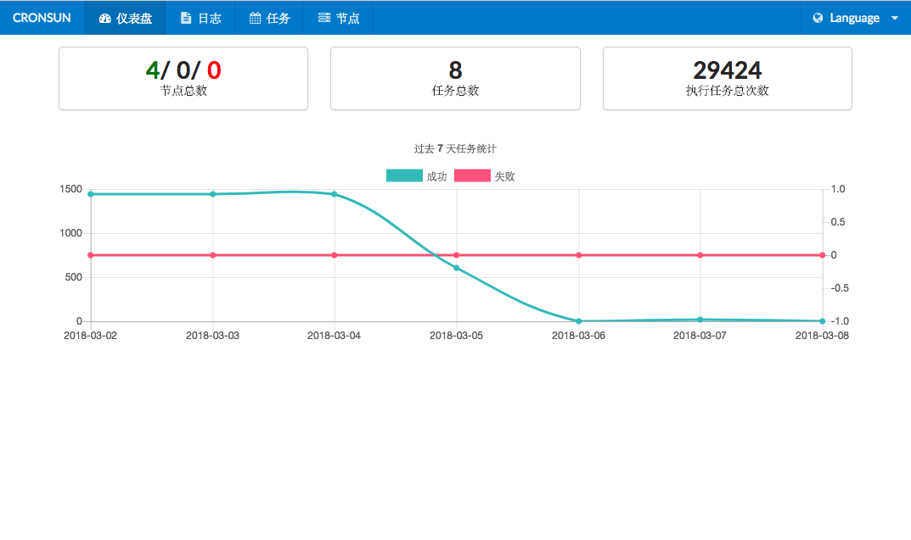
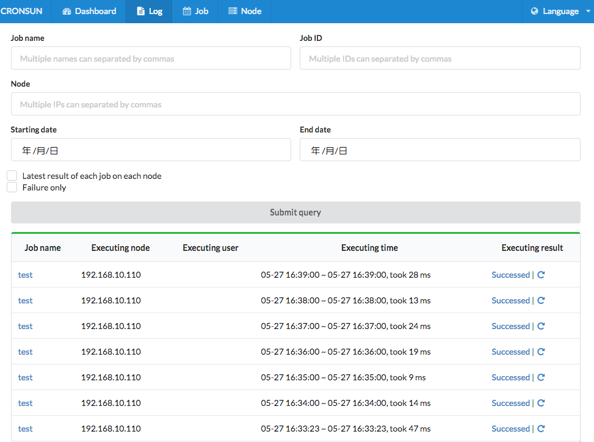
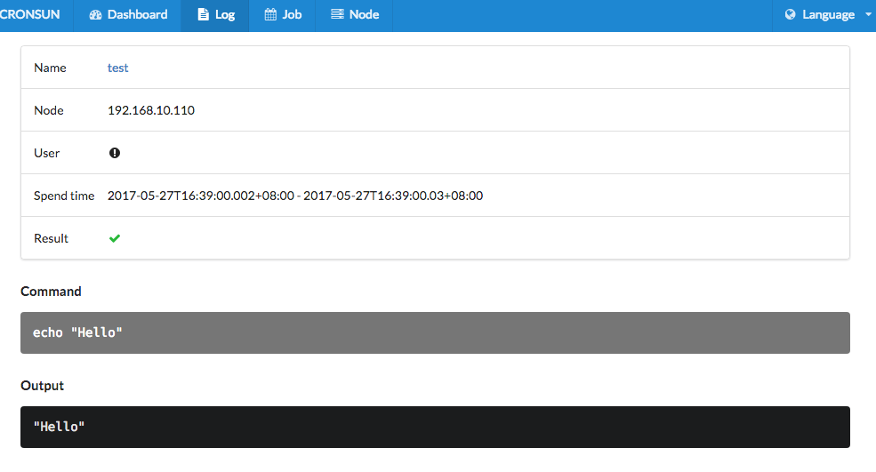
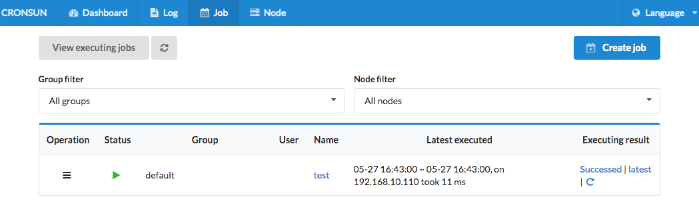
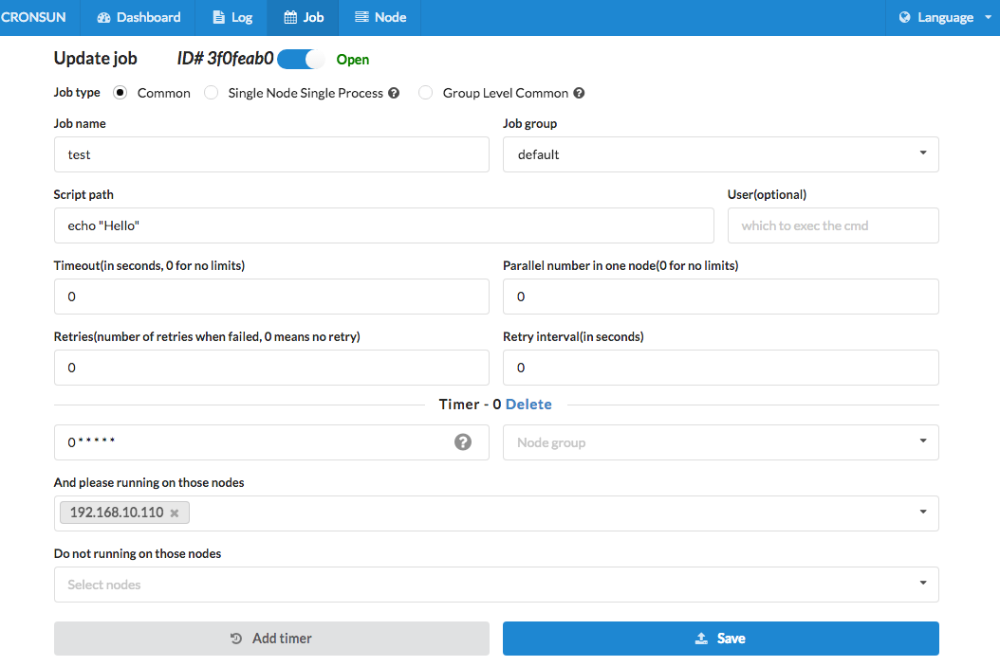
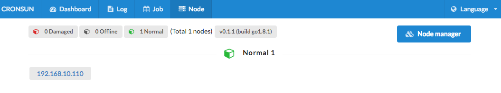

# cronsun [](https://travis-ci.org/shunfei/cronsun)

`cronsun` is a distributed cron-style job system. It's similar with `crontab` on stand-alone `*nix`.

[简体中文](README_ZH.md)

## Purpose

The goal of this project is to make it much easier to manage jobs on lots of machines and provides high availability.
`cronsun` is different from [Azkaban](https://azkaban.github.io/), [Chronos](https://mesos.github.io/chronos/), [Airflow](https://airflow.incubator.apache.org/).

## Features

- Easy manage jobs on multiple machines
- Managemant panel
- Mail service
- Multi-language support
- Simple authentication and accounts manager(default administrator email and password: admin@admin.com/admin)

## Status

`cronsun` has been tested in production for years on hundreds of servers. 
Although the current version is not release as an stable version, but we think it is completely available for the production environment.
We encourage you to try it, it's easy to use, see how it works for you. We believe you will like this tool.


## Architecture

```
                                                [web]
                                                  |
                                     --------------------------
           (add/del/update/exec jobs)|                        |(query job exec result)
                                   [etcd]                 [mongodb]
                                     |                        ^
                            --------------------              |
                            |        |         |              |
                         [node.1]  [node.2]  [node.n]         |
             (job exec fail)|        |         |              |
          [send mail]<-----------------------------------------(job exec result)

```


## Security

`cronsun` support security with `security.json` config. When `open=true`， job command is only allow local files with special extension on the node.

```json
{
    "open": true,
    "#users": "allowed execution users",
    "users": [
        "www", "db"
    ],
    "#ext": "allowed execution file extensions",
    "ext": [
        ".cron.sh", ".cron.py"
    ]
}
```

## Getting started

### Setup / installation

Install from binary [latest release](https://github.com/shunfei/cronsun/releases/latest)

Or build from source ([feature/glide](https://github.com/shunfei/cronsun/tree/feature/glide)), require `go >= 1.9+`, [glide](https://glide.sh/)

```
go get -u github.com/shunfei/cronsun
cd $GOPATH/src/github.com/shunfei/cronsun
git checkout feature/glide
glide update
sh build.sh
```

### Run

1. Install [MongoDB](http://docs.mongodb.org/manual/installation/)
2. Install [etcd3](https://github.com/coreos/etcd)
3. Open and update Etcd(`conf/etcd.json`) and MongoDB(`conf/db.json`) configurations
4. Start cronnode: `./cronnode -conf conf/base.json`, start cronweb: `./cronweb -conf conf/base.json`
5. Open `http://127.0.0.1:7079` in browser

## Screenshot

**Brief**:



**Exec result**:




**Job**:





**Node**:



## Credits

cron is base on [robfig/cron](https://github.com/robfig/cron)
