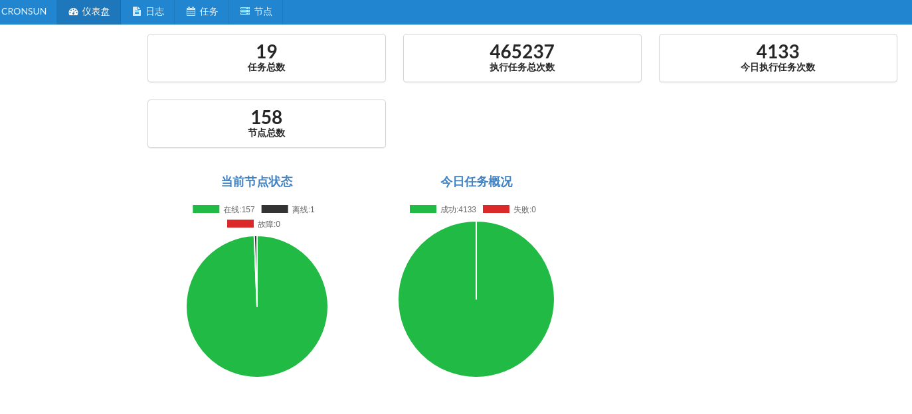
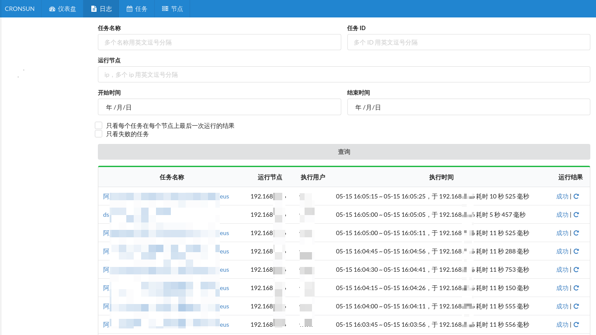
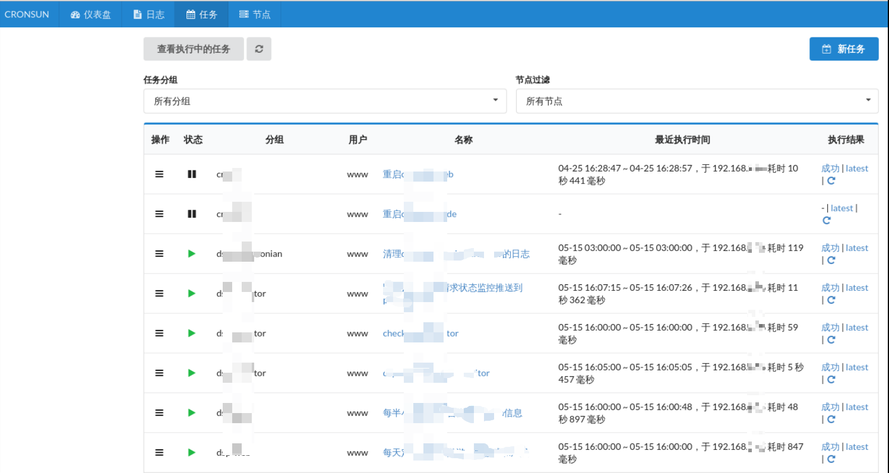
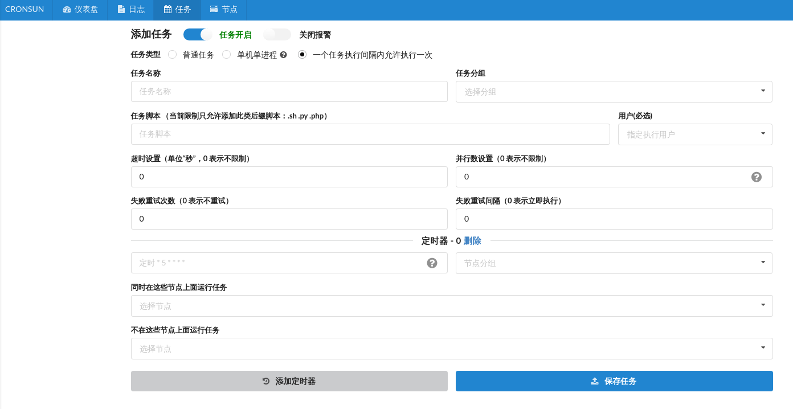
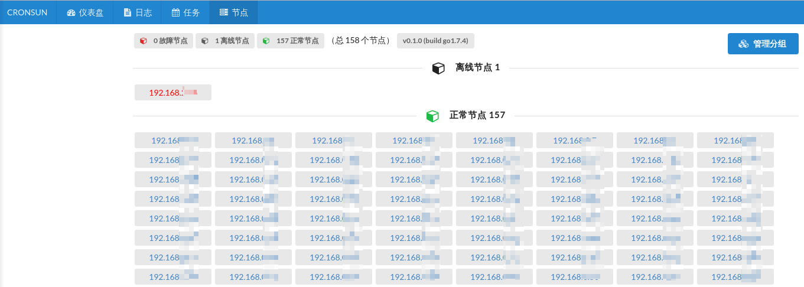

# cronsun [](https://travis-ci.org/shunfei/cronsun)

`cronsun` 是一个分布式任务系统，单个结点和 `*nix` 机器上的 `crontab` 近似。支持界面管理机器上的任务，支持任务失败邮件提醒，安装简单，使用方便，是替换 `crontab` 一个不错的选择。

`cronsun` 是为了解决多台 `*nix` 机器上`crontab` 任务管理不方便的问题，同时提供任务高可用的支持（当某个节点死机的时候可以自动调度到正常的节点执行）。`cronsun` 和 [Azkaban](https://azkaban.github.io/)、[Chronos](https://mesos.github.io/chronos/)、[Airflow](https://airflow.incubator.apache.org/) 这些不是同一类型的。

> QQ交流群： 123731057

## 项目状态

`cronsun`已经在线上几百台规模的服务器上面稳定运行了一年多了，虽然目前版本不是正式版，但是我们认为是完全可以用于生产环境的。强烈建议你试用下，因为它非常简单易用，同时感受下他的强大，相信你会喜欢上这个工具的。

## 架构

```
                                                [web]
                                                  |
                                     --------------------------
           (add/del/update/exec jobs)|                        |(query job exec result)
                                   [etcd]                 [mongodb]
                                     |                        ^
                            --------------------              |
                            |        |         |              |
                         [node.1]  [node.2]  [node.n]         |
             (job exec fail)|        |         |              |
          [send mail]<-----------------------------------------(job exec result)

```


## 安全性

`cronsun`是在管理后台添加任务的，所以一旦管理后台泄露出去了，则存在一定的危险性，所以`cronsun`支持`security.json`的安全设置：

```json
{
    "open": true,
    "#users": "允许选择运行脚本的用户",
    "users": [
        "www", "db"
    ],
    "#ext": "允许添加以下扩展名结束的脚本",
    "ext": [
        ".cron.sh", ".cron.py"
    ]
}
```

如上设置开启安全限制，则添加和执行任务的时候只允许选择配置里面指定的用户来执行脚本，并且脚本的扩展名要在配置的脚本扩展名限制列表里面。


## 开始

### 安装

直接下载执行文件 [latest release](https://github.com/shunfei/cronsun/releases/latest)。

如果你熟悉 `Go`，也可以从源码编译, 要求 `go >= 1.9+`

```
go get -u github.com/shunfei/cronsun
cd $GOPATH/src/github.com/shunfei/cronsun
sh build.sh
```

### 运行

1. 安装 [MongoDB](http://docs.mongodb.org/manual/installation/)
2. 安装 [etcd3](https://github.com/coreos/etcd)
3. 修改 `conf` 相关的配置
4. 在任务结点启动 `./cronnode -conf conf/base.json`，在管理结点启动 `./cronweb -conf conf/base.json`
5. 访问管理界面 `http://127.0.0.1:7079/ui/`

### 关于后台权限

当前实现了一个可选的简单登录认证和帐号管理的功能（首次启用之后默认管理员的邮箱密码是 admin@admin.com/admin），没有详细的权限管理功能。登录控制也可以考虑使用 [aproxy](https://github.com/shunfei/aproxy) ，相关介绍见 [aProxy: 带认证授权和权限控制的反向代理](http://www.cnblogs.com/QLeelulu/p/aproxy.html)。

## 截图

**概要**:



**执行日志**:



**任务管理**:





**结点状态**:



## 致谢

cron is base on [robfig/cron](https://github.com/robfig/cron)
